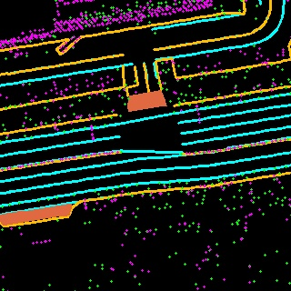
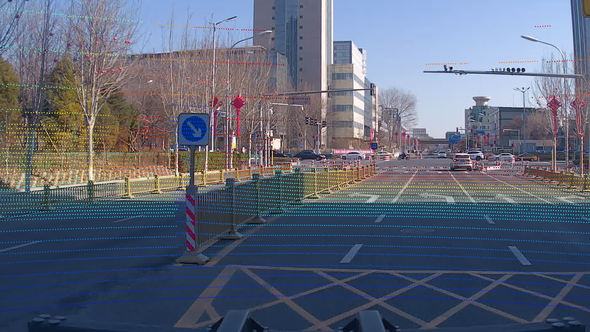

# EgoVM-dataset

## Dataset Description
This is the dataset for EgoVM, and each frame contains six images, a lidar point cloud, a ground truth lidar pose, extrinsics and intrinsics, and surrounding vectorized map elements.

## Dataset Format
The directory structure of the dataset is shown below.
```python
-data
--backward
---[frame_id].jpg
--left_backward
---[frame_id].jpg
--left_forward
---[frame_id].jpg
--right_backward
---[frame_id].jpg
--right_forward
---[frame_id].jpg
--short
---[frame_id].jpg
--npz
---[frame_id].npz
```
There are six camera directories, each of which stores each frame of the image from the six camera views: backward, left_backward, left_forward, right_backward, right_forward, short(front). In addition, there is an npz directory that stores additional information about each frame. The contents of each [frame_id].npz file are as follows:
```python
camera_extrinsic.npy # image to lidar, shape: 6x7, each row: [x, y, z, qx, qy, qz, qw]
camera_intrinsic.npy # [fx, fy, cx, cy, k_1, k_2, p_1, p_2, k_3]
pose.npy
# vectorized map elements
curb_0.npy # 0th curb, shape: C0 x 4, each row represents one segment: [x1, y1, x2, y2]
curb_1.npy # 1th curb, shape: C1 x 4, each row represents one segment: [x1, y1, x2, y2]
...
lane_dashed_0.npy # 0th dashed lane, shape: D0 x 4, each row represents one segment: [x1, y1, x2, y2]
lane_dashed_1.npy # 1th dashed lane, shape: D1 x 4, each row represents one segment: [x1, y1, x2, y2]
...
lane_solid_0.npy # 0th solid lane, shape: S0 x 4, each row represents one segment: [x1, y1, x2, y2]
lane_solid_1.npy # 1th solid lane, shape: S1 x 4, each row represents one segment: [x1, y1, x2, y2]
...
crosswalk_0.npy # 0th crosswalk, shape: W0 x 4, each row represents one segment: [x1, y1, x2, y2]
crosswalk_1.npy # 1th crosswalk, shape: W1 x 4, each row represents one segment: [x1, y1, x2, y2]
...
stop_line_0.npy # 0th stop line, shape: L0 x 4, each row represents one segment: [x1, y1, x2, y2]
stop_line_1.npy # 1th stop line, shape: L1 x 4, each row represents one segment: [x1, y1, x2, y2]
...
pole.npy # shape: P x 4, each row represents one pole: [x, y, 0, h]
surfel.npy # shape: F x 9: each row represents one surfel: [x, y, z, norm_x, norm_y, norm_z, eigenvalue_0, eigenvalue_1, eigenvalue_2]
```

## Visualization
We provide a visualization tool that generates the BEV semantic segmentation ground truth for each frame of data, the point cloud pcd, and the projection of the point cloud onto six images by running the following command:
```python
python vis.py [frame_id]
```
where [frame_id] is the name prefix of each frame. Specially, we offer the visualization results for the command ``python vis.py 1645669277368776960`` in the directory ``vis/``. The BEV semantic segmentation ground truth of frame ``1645669277368776960`` is as follows:



The point cloud projection on the front image is as follows:

